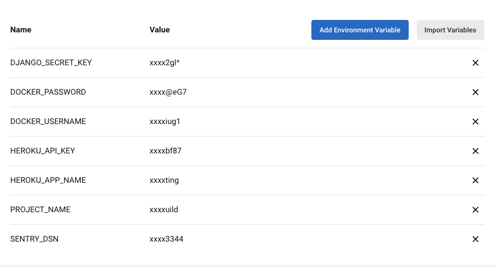

  

## Résumé

Site web d'Orange County Lettings

## Développement local

### Prérequis

- Compte GitHub avec accès en lecture à ce repository
- Git CLI
- SQLite3 CLI
- Interpréteur Python, version 3.6 ou supérieure

Dans le reste de la documentation sur le développement local, il est supposé que la commande `python` de votre OS shell exécute l'interpréteur Python ci-dessus (à moins qu'un environnement virtuel ne soit activé).

### macOS / Linux

#### Cloner le repository

- `cd /path/to/put/project/in`
- `git clone https://github.com/OpenClassrooms-Student-Center/Python-OC-Lettings-FR.git`

#### Créer l'environnement virtuel

- `cd /path/to/Python-OC-Lettings-FR`
- `python -m venv venv`
- `apt-get install python3-venv` (Si l'étape précédente comporte des erreurs avec un paquet non trouvé sur Ubuntu)
- Activer l'environnement `source venv/bin/activate`
- Confirmer que la commande `python` exécute l'interpréteur Python dans l'environnement virtuel
`which python`
- Confirmer que la version de l'interpréteur Python est la version 3.6 ou supérieure `python --version`
- Confirmer que la commande `pip` exécute l'exécutable pip dans l'environnement virtuel, `which pip`
- Pour désactiver l'environnement, `deactivate`

#### Exécuter le site

- `cd /path/to/Python-OC-Lettings-FR`
- `source venv/bin/activate`
- `pip install --requirement requirements.txt`
- `python manage.py runserver`
- Aller sur `http://localhost:8000` dans un navigateur.
- Confirmer que le site fonctionne et qu'il est possible de naviguer (vous devriez voir plusieurs profils et locations).

#### Linting

- `cd /path/to/Python-OC-Lettings-FR`
- `source venv/bin/activate`
- `flake8`

#### Tests unitaires

- `cd /path/to/Python-OC-Lettings-FR`
- `source venv/bin/activate`
- `pytest`

#### Base de données

- `cd /path/to/Python-OC-Lettings-FR`
- Ouvrir une session shell `sqlite3`
- Se connecter à la base de données `.open oc-lettings-site.sqlite3`
- Afficher les tables dans la base de données `.tables`
- Afficher les colonnes dans le tableau des profils, `pragma table_info(Python-OC-Lettings-FR_profile);`
- Lancer une requête sur la table des profils, `select user_id, favorite_city from
  Python-OC-Lettings-FR_profile where favorite_city like 'B%';`
- `.quit` pour quitter

#### Panel d'administration

- Aller sur `http://localhost:8000/admin`
- Connectez-vous avec l'utilisateur `admin`, mot de passe `Abc1234!`

### Windows

Utilisation de PowerShell, comme ci-dessus sauf :

- Pour activer l'environnement virtuel, `.\venv\Scripts\Activate.ps1` 
- Remplacer `which <my-command>` par `(Get-Command <my-command>).Path`

### Docker

#### local

- Télécharger et installer [Docker](https://docs.docker.com/get-docker/)
- Se rendre dans le repertoire du projet `cd /path/to/Python-OC-Lettings-FR`
- Créer l'image `docker build -t <image-name> .` 
- Lancer le conteneur `docker run -d -p 8080:8080 <image-name>`
- Lancer un navigateur avec l'adresse http://127.0.0.1:8080/

#### hub

- Utiliser la commande `docker login`
- Tager l'image avec `docker tag <dockerhub username>/<dockerhub name>:<tagname>`
- Envoyer l'image sur le Hub avec `docker push <dockerhub username>/<dockerhub name>:<tagname>`

- Télécharger une image du Hub avec ©docker pull <dockerhub username>/<dockerhub name>:<tagname>`
- Lancer l'image avec `docker run -d -p 8000:8000 <dockerhub username>/<dockerhub name>:<tagname>`
- Lancer un navigateur avec l'adresse http://127.0.0.1:8080/

# Déploiement

### Obligatoire
Pour faire fonctionner le déploiement de cette application il est nécessaires d'avoir les comptes suivant
- Compte [GitHub](https://github.com/)
- Compte [CircleCI](https://circleci.com) 
- Compte [Docker](https://www.docker.com)
- Compte [Heroku](https://www.heroku.com)
- Compte [Sentry](https://sentry.io/welcome/)

### Description
Le déploiement de l'application est automatisé par un pipeline CircleCI.

Si des modifications sont apportées à la branche master :

1) Lancement du linting et des tests. 
2) Création d'une image Docker et dépôt sur le DockerHub. 
3) Déploiement de l'application sur Heroku.

si une des étapes suivante échoue le déploiement est arrêté

### CircleCI

Créer les variables d'environnements suivant dans le projet CircleCi :

  

### Heroku

Installation de gunicorn :
  `pip install gunicorn`

Ne pas oublier de créer le Procfile à la racine du projet : 

`web: gunicorn oc_lettings_site.wsgi --bind=0.0.0.0:$PORT`

# Lancement

- Allez sur `https://<heroku-app-name>.herokuapp.com`
- Naviguez jusqu'à :`https://<heroku-app-name>.herokuapp.com/sentry-debug` 
ceci devrait déclencher une erreur dans sentry.
- Naviguez jusqu'au panneau d'administration :`https://<heroku-app-name>.herokuapp.com/admin` 
- Connectez-vous avec le compte `admin`, mot de passe `Abc1234!`
